<div align="center">

# Conformal

### Static Shape & Dimension Analysis for MATLAB

[](#cli-options)
[](https://marketplace.visualstudio.com/items?itemName=EthanDoughty.conformal)
[](https://dotnet.microsoft.com/download)
[](#test-suite)
[](LICENSE)

> Conformal is an independent project and is not affiliated with, endorsed by, or connected to MathWorks, Inc. MATLAB is a registered trademark of MathWorks, Inc.

</div>

---

Conformal catches matrix dimension errors in MATLAB code before runtime, without needing MATLAB installed.

```matlab
A = zeros(3, 4);
B = zeros(5, 2);
C = A * B;
```

```
W_INNER_DIM_MISMATCH line 3: A * B: inner dims 4 vs 5
```

Conformal tracks the shapes of both matrices, A and B, from their assignments, and the `*` on line 3 requires A's column count to match B's row count. The mismatch is caught at analysis time instead of failing at runtime.

That works for simple cases. The harder problems live in longer code, where shapes flow through function calls, loops, and branches, and a single wrong constant can stay hidden. Consider a Kalman filter update with a hardcoded identity matrix:

```matlab
function [x_upd, P_upd] = kalman_update(x, P, H, z, R)
    y = z - H * x;
    S = H * P * H' + R;
    K = P * H' * inv(S);
    x_upd = x + K * y;
    P_upd = (eye(3) - K * H) * P;    % bug: should be eye(4)
end

x = zeros(4, 1);  P = eye(4);
H = [1 0 0 0; 0 1 0 0];  R = 0.5 * eye(2);  z = [1; 2];
[x_upd, P_upd] = kalman_update(x, P, H, z, R);
```

```
W_ELEMENTWISE_MISMATCH line 6: eye(3) - (K * H): matrix[3 x 3] vs matrix[4 x 4]
  (in kalman_update, called from line 12)
```

It follows H, P, K, and x through each multiply, treats H' as the transpose of H, carries inv(S) as shape-preserving, and catches the mismatch where eye(3) produces 3 x 3 but K * H is 4 x 4. The diagnostic carries the full call stack, so the error traces back to the call site on line 12.

## Installation

[Prebuilt binaries for Linux, macOS, and Windows are available on the releases page.](https://github.com/EthanDoughty/conformal/releases) These are self-contained executables with no dependencies.

```bash
conformal file.m
```

The VS Code extension is the recommended option for regular use. Install it from the [VS Code Marketplace](https://marketplace.visualstudio.com/items?itemName=EthanDoughty.conformal) by searching "Conformal" in Extensions, or with:

```bash
code --install-extension EthanDoughty.conformal
```

Open any .m file and diagnostics appear as squiggly red/yellow underlines. Hovering a variable shows its inferred shape.

To build from source, clone the repository and use the [.NET 8.0 SDK](https://dotnet.microsoft.com/download).

```bash
git clone https://github.com/EthanDoughty/conformal.git
cd conformal
dotnet run --project src/analyzer/ConformalAnalyzer.fsproj -- file.m
```

## Screenshots


Conformal can also show the inferred shape of any variable on hover, and annotate first assignments with inlay hints:


## What Conformal Tracks

The analyzer catches dimension mismatches across arithmetic (+, -, *, .*, ./, ^, .^, \), concatenation ([A B], [A; B]), and indexing (A(i,j), A(:,j), C{i}, A(end-1, :)). It handles scalar-matrix broadcasting, so s * A works without a false warning, and when * appears where .* was probably intended, it can suggest the fix.

It recognizes a large set of MATLAB builtins, and many of them carry explicit shape rules, including matrix constructors, reductions with dimension arguments, reshaping, type predicates, and linear algebra functions. User-defined functions are analyzed at each call site with the caller's argument shapes, and that reaches nested functions, anonymous functions with closure capture, nargin/nargout patterns, varargin/varargout, and cross-file resolution to sibling .m files.

Variables with unknown concrete size get symbolic names like n, m, k, and those names propagate through operations with a polynomial representation, so n+m and m+n are recognized as equal, and n+n simplifies to 2*n.

When a range is built from values that are fixed at analysis time, like 0:step:stop with a known start, step, and stop, the analyzer works out its concrete length, so a later dimension mismatch involving the range can be caught. The length is computed the same way MATLAB builds the range. It stays conservative whenever a value might change through a loop, a branch, or a reassignment, so it will not report a length it cannot be sure of.

Conformal also tracks struct fields and cell array elements, with per-element shape tracking, handles basic classdef objects, and joins shapes conservatively across control-flow branches. Loops can run single-pass, or use widening-based fixpoint iteration via `--fixpoint`.

Alongside shape inference, it tracks scalar integer variables through an interval domain. That domain flags out-of-bounds indexing, division by zero, and negative dimensions. Branch conditions narrow the intervals, and a relational domain tracks upper-bound relations from loop ranges to keep false positives down.

For dimension conflict warnings, Conformal can produce a concrete counterexample that proves the bug is real. In `--witness filter` mode, only the warnings backed by a counterexample are shown, and `--coder` adds a post-analysis pass that checks for constructs MATLAB Coder cannot handle.

## VS Code Extension

The VS Code extension runs the analyzer in-process, since the F# codebase is compiled to JavaScript using the Fable tool. The compiled analyzer is bundled directly into the extension with no external runtime dependency.

Diagnostics appear as underlines as code is typed, behind a short, configurable debounce. Hovering a variable shows its inferred shape, and go-to-definition works for both local and cross-file functions. Document symbols populate the sidebar, and built-in MATLAB syntax highlighting is included, so the MathWorks extension is not needed.

| Setting | Default | Description |
|---------|---------|-------------|
| `conformal.fixpoint` | `false` | Enable fixed-point loop analysis |
| `conformal.strict` | `false` | Show all warnings including low-confidence diagnostics |
| `conformal.analyzeOnChange` | `true` | Analyze as code is typed, behind a short debounce |
| `conformal.inlayHints` | `true` | Show inferred shapes as inlay hints on first assignment |

## Neovim

The analyzer doubles as a Language Server over stdio, so any LSP-capable editor can drive it. A ready-to-use Neovim client lives at [`editors/nvim/conformal.lua`](editors/nvim/conformal.lua) and needs no plugins. Put it on the `runtimepath`, for example under `~/.config/nvim/lua/`, and call it once.

```lua
require("conformal").setup()
```

This attaches the server to `matlab` and `octave` buffers and provides diagnostics, hover, document symbols, go-to-definition, quick-fix code actions, and inferred-shape inlay hints. The `conformal` binary has to be on the `$PATH`, or point at it directly with `setup({ cmd = { "/path/to/conformal", "--lsp" } })`. Users on nvim-lspconfig or the native `vim.lsp.config` API can register the same `conformal --lsp` command instead.

## CLI Options

```bash
conformal file.m
```

| Flag | What it does |
|------|-------------|
| `--tests` | Run the full test suite (585 tests across 24 categories) |
| `--batch <dir\|files>` | Analyze multiple files in one process (no per-file startup cost) |
| `--strict` | Show all warnings including informational and low-confidence diagnostics |
| `--fixpoint` | Use widening-based fixpoint iteration for loop analysis |
| `--fail-on-warnings` | Exit with code 1 if any warnings are found |
| `--witness [MODE]` | Attach incorrectness witnesses (`enrich`, `filter`, or `tag`) |
| `--coder` | Run the MATLAB Coder compatibility pass (combine with `--strict`) |
| `--format sarif` | Emit diagnostics as SARIF 2.1.0 JSON to stdout |
| `--quiet` | Suppress per-test output during `--tests`, only print failures |
| `--lsp` | Start the native Language Server Protocol server |
| `--version` | Print version and exit |

The exit code is `0` on success and `1` on a parse error, test failure, or when `--fail-on-warnings` is set and warnings are found.

## CI Integration

Conformal produces [SARIF 2.1.0](https://sarifweb.azurewebsites.net/) output, which can be uploaded to GitHub Code Scanning for inline PR annotations. Each SARIF artifact includes a SHA-256 hash of the analyzed source file for audit traceability, and the `--fail-on-warnings` flag can be used as a required status check.

```yaml
- name: Run Conformal
  run: conformal --batch src/ --format sarif --fail-on-warnings > results.sarif

- name: Upload SARIF
  uses: github/codeql-action/upload-sarif@v3
  with:
    sarif_file: results.sarif
```

A pre-commit hook and a MATLAB wrapper called conformal_check.m are also available in the [site/](site/) directory.

## Performance

Conformal runs single-threaded in a single pass over the IR. On a Ryzen 9 5900X at 3.7 GHz (single core, WSL2), the full test suite finishes in about a second. Single-file analysis typically takes under 100ms for files up to a few thousand lines, though .NET startup adds roughly 600ms to each CLI invocation. The VS Code extension avoids this startup cost entirely since it runs the analyzer in-process as compiled JavaScript.

Analysis time scales with code complexity rather than just line count. A 700-line stress test with 26 warnings takes about 190ms to analyze, while a 2,500-line file that is mostly data declarations finishes in 60ms. Each stage of the pipeline has bounded complexity:

- Lexer: O(n), a single linear scan over the source characters.
- Parser: O(n · k), recursive descent where k is the max expression nesting depth, bounded to roughly 10 in practice.
- Shape analysis: O(s · m), one pass over s statements with O(log m) environment lookups per statement via immutable balanced maps, where m is the number of live variables.
- Interval and relational domains: O(1) per variable per statement, since all bound operations are constant-time arithmetic on [lo, hi] pairs.
- Loop widening: bounded to exactly 3 phases (discover, stabilize, narrow) rather than iterating to a true fixpoint, so each loop body is analyzed at most 3 times.
- Dimension equivalence: O(α(k)) amortized per operation via union-find with path compression, where k is the number of symbolic dimension names.
- Reduced product (TightenDomains): at most 3 propagation rounds per call, each O(v log v) in the number of tracked variables v.

The total cost for a single file works out to O(n) + O(n · k) + O(s · m) + O(b · v log v), where b is the number of branch/loop join points. Since k, m, and v are all small bounded constants for typical MATLAB code, the analysis is effectively linear in the source length.





## Real-World Compatibility

Conformal was tested against a corpus of 15,085 .m files from 34 open-source projects on GitHub, covering aerospace, optimization, numerical methods, biomedical signal processing, power systems, geophysics, computer vision, and CFD. The corpus produces zero crashes across all 15,085 files.

The projects include chebfun (3,435 files), PlatEMO (2,416), YALMIP (1,665), ecg-kit (1,195), MATPOWER (979), gptoolbox (700), GISMO (689), eeglab (658), LADAC (607), and NASA MUSCAT (251). These files include classdef OOP, older end-less function definitions, space-separated multi-return syntax, stencil patterns, symbolic toolbox calls, and complex matrix literal spacing.

## Warning Tiers

By default, the analyzer shows every high-confidence warning, including shape errors, type errors, indexing checks, interval-based checks like `W_INDEX_OUT_OF_BOUNDS` and `W_DIVISION_BY_ZERO`, constraint conflicts, and cross-file resolution. The default codes are available with no configuration.

The `--strict` flag adds lower-confidence codes like `W_SUSPICIOUS_COMPARISON` and `W_REASSIGN_INCOMPATIBLE`, so default mode runs clean in CI without false-positive noise, and strict mode gives more context when needed.

## Conformal Migrate (Preview)

Conformal also includes a MATLAB-to-Python transpiler that uses shape information to pick the right numpy operator, rather than relying on syntactic patterns alone. It handles many MATLAB builtins, 1-to-0 index conversion, varargin to *args, copy semantics, and shape-aware operator dispatch, choosing np.dot for a matrix multiply and * for an element-wise one.

## Test Suite

Conformal is validated by 585 self-checking MATLAB programs organized into 24 categories, plus property-based lattice tests via FsCheck. Each test file embeds its expected behavior as inline assertions (`% EXPECT: A = matrix[3 x 4]`, `% EXPECT_WARNING: W_INNER_DIM_MISMATCH`), and the test runner checks that Conformal's output matches.

For the full test listing, see [docs/tests.md](docs/tests.md).

## Project Structure

```
src/core/               F# core library (lexer, parser, shape inference, builtins, diagnostics)
src/shared/             Shared utilities
src/analyzer/           CLI, LSP server, test runner
src/migrate/            MATLAB-to-Python transpiler (~2,100 LOC)
vscode-conformal/       VS Code extension (TypeScript client + Fable-compiled analyzer)
  fable/                Fable compilation project (F# to JavaScript, shares core .fs files)
  src/                  TypeScript extension and LSP server code
editors/nvim/           Neovim LSP client (single Lua file, no plugins)
tests/                  self-checking MATLAB programs across 24 categories
.github/                CI workflow (build, test, compile Fable, package VSIX)
```

## Limitations

Conformal analyzes a subset of MATLAB, focused on the matrix-heavy computational core where dimension errors are most common and most costly.

It does not support the eval function, which is inherently undecidable to analyze statically, N-D arrays beyond 2-D, or complex number tracking.

For the full details on what is and isn't covered, see [docs/analysis.md](docs/analysis.md).

## Feedback

Conformal recognizes a large set of builtins and aims for a low false-positive rate, though real code tends to surface gaps. If it does not recognize a function, a quick [missing builtin report](https://github.com/EthanDoughty/conformal/issues/new?template=missing-builtin.yml) is the fastest way to get it added, and if it flags code you know is correct, a [false positive report](https://github.com/EthanDoughty/conformal/issues/new?template=false-positive.yml) with a minimal snippet and the shapes involved is usually enough to reproduce and fix. For anything else, the [issue tracker](https://github.com/EthanDoughty/conformal/issues/new/choose) is open. A report that comes with a reproducible snippet tends to land in the test corpus, so the same case does not regress later.

<details>
<summary><h2>References</h2></summary>

Conformal's abstract interpretation techniques draw on decades of research in static analysis and formal methods.

### Foundational

- P. Cousot and R. Cousot, "Abstract interpretation: a unified lattice model for static analysis of programs by construction or approximation of fixpoints," *POPL*, 1977. [ACM DL](https://dl.acm.org/doi/10.1145/512950.512973)
- P. Cousot, R. Cousot, and L. Mauborgne, "The Reduced Product of Abstract Domains and the Combination of Decision Procedures," *FoSSaCS*, 2011.
- P. Cousot et al., "A Personal Historical Perspective on Abstract Interpretation," 2024.

### Abstract Domains

- A. Mine, "The Octagon Abstract Domain," *Higher-Order and Symbolic Computation*, vol. 19, no. 1, 2006. [HAL](https://hal.science/hal-00136639/document)
- F. Logozzo and M. Fahndrich, "Pentagons: A Weakly Relational Abstract Domain," *SAS*, 2008. [Microsoft Research](https://www.microsoft.com/en-us/research/wp-content/uploads/2009/01/pentagons.pdf)
- F. Ranzato, "The Best of Abstract Interpretations," *POPL*, 2025.
- A. Pitchanathan et al., "Strided Difference Bound Matrices," *CAV*, 2024.
- A. Lesbre et al., "Relational Abstractions Based on Labeled Union-Find," *PLDI*, 2025.

### Industrial Analyzers

- B. Blanchet et al., "A Static Analyzer for Large Safety-Critical Software," *PLDI*, 2003. (Astree)
- P. Cousot et al., "The ASTREE Analyzer," *ESOP*, 2005. [PDF](https://www.di.ens.fr/~cousot/publications.www/CousotEtAl-ESOP05.pdf)

### Data Structures

- S. Conchon and J.-C. Filliatre, "A Persistent Union-Find Data Structure," *ML Workshop*, 2007.

### MATLAB-Specific

- P. Joisha and P. Banerjee, "Static Array Storage Optimization in MATLAB," *PLDI*, 2003.

### Constraint and Shape Inference

- G. Zilberstein and D. Dreyer, "A Combination of Abstract Interpretation and Constraint Programming," 2024. [PDF](https://ghilesz.github.io/papers/manuscrit.pdf)
- MLIR Shape Inference. [Documentation](https://mlir.llvm.org/docs/ShapeInference/)

### Safety Standards

- DO-178C, "Software Considerations in Airborne Systems and Equipment Certification," RTCA, 2011.
- IEC 61508, "Functional Safety of Electrical/Electronic/Programmable Electronic Safety-Related Systems."

</details>
