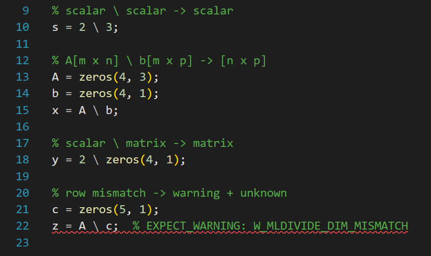
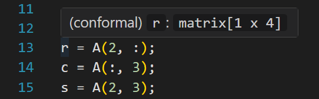
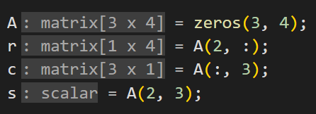

<div align="center">

# Conformal

### Static Shape & Dimension Analysis for MATLAB

[](#cli-options)
[](https://marketplace.visualstudio.com/items?itemName=EthanDoughty.conformal)
[](https://dotnet.microsoft.com/download)
[](#test-suite)
[](LICENSE)

*Matrices must be **conformable** before they can perform. Conformal makes sure they are.*

> Conformal is an independent project and is not affiliated with, endorsed by, or connected to MathWorks, Inc. MATLAB is a registered trademark of MathWorks, Inc.

</div>

---

Conformal catches matrix dimension errors in MATLAB code before runtime. If `A * B` has an inner dimension mismatch, Conformal flags it at analysis time instead of letting it fail silently. It tracks shapes through assignments, function calls, control flow, loops, and symbolic dimensions, all without needing MATLAB installed.

## Screenshots



Conformal also shows the inferred shape of any variable on hover, and can annotate first assignments with inlay hints:





## Quick Start

**VS Code** (the recommended option): Install Conformal from the [VS Code Marketplace](https://marketplace.visualstudio.com/items?itemName=EthanDoughty.conformal) by searching "Conformal" in Extensions, or run the following command:
```bash
code --install-extension EthanDoughty.conformal
```
Open any `.m` file and the diagnostics appear as underlines. Hover a variable to see its inferred shape. No configuration is needed.

**CLI**: Requires [.NET 8.0 SDK](https://dotnet.microsoft.com/download) or later. Again, no MATLAB installation is required.
```bash
git clone https://github.com/EthanDoughty/conformal.git
cd conformal
dotnet run --project src/analyzer/ConformalAnalyzer.fsproj -- tests/basics/inner_dim_mismatch.m
```

## What Conformal Catches

Conformal tracks the shape of every variable and flags dimension mismatches, type errors, and structural problems. Consider a Kalman filter update with a hardcoded identity matrix:

```matlab
function [x_upd, P_upd] = kalman_update(x, P, H, z, R)
    y = z - H * x;
    S = H * P * H' + R;
    K = P * H' * inv(S);
    x_upd = x + K * y;
    P_upd = (eye(3) - K * H) * P;    % bug: should be eye(4)
end

x = zeros(4, 1);  P = eye(4);
H = [1 0 0 0; 0 1 0 0];  R = 0.5 * eye(2);  z = [1; 2];
[x_upd, P_upd] = kalman_update(x, P, H, z, R);
```

```
W_ELEMENTWISE_MISMATCH line 6: eye(3) - (K * H): matrix[3 x 3] vs matrix[4 x 4]
  (in kalman_update, called from line 12)
```

Conformal follows `H`, `P`, `K`, and `x` through each multiply, tracks `H'` as the transpose of `H`, knows that `inv(S)` preserves shape, and catches the mismatch where `eye(3)` produces `3 x 3` but `K * H` is `4 x 4`.

Conformal detects dimension mismatches across arithmetic (`+`, `-`, `*`, `.*`, `./`, `^`, `.^`, `\`), concatenation (`[A B]`, `[A; B]`), and indexing (`A(i,j)`, `A(:,j)`, `C{i}`, `A(end-1, :)`). Scalar-matrix broadcasting is handled, so `s * A` works without a false warning. If `*` is used where `.*` was probably intended, Conformal suggests the fix.

Over 635 MATLAB builtins are recognized, and around 315 have explicit shape rules, including matrix constructors, reductions with dimension arguments, reshaping, type predicates, and linear algebra functions. User-defined functions are analyzed at each call site with the caller's argument shapes, and that includes nested functions, anonymous functions with closure capture, `nargin`/`nargout` patterns, `varargin`/`varargout`, and cross-file workspace resolution to sibling `.m` files.

Variables with unknown concrete size get symbolic names like `n`, `m`, `k`, and those names propagate through operations with a polynomial representation, so `n+m` and `m+n` are recognized as equal, and `n+n` simplifies to `2*n`.

Conformal also tracks struct fields and cell array elements (including per-element shape tracking), handles basic `classdef` objects, and joins shapes conservatively across control flow branches. Loops can use single-pass analysis or widening-based fixpoint iteration via `--fixpoint`.

In parallel with shape inference, Conformal tracks scalar integer variables through an interval domain, which enables out-of-bounds indexing detection, division-by-zero detection, and negative dimension warnings. Branch conditions narrow intervals, and a Pentagon relational domain tracks upper-bound relations from loop ranges to suppress false positives.

For dimension conflict warnings, Conformal can produce a concrete counterexample proving the bug is real. In `--witness filter` mode, only warnings with a verified witness are shown, which means zero false positives. The `--coder` flag adds a post-analysis pass that checks for constructs MATLAB Coder can't handle.

## VS Code Extension

The VS Code extension runs the analyzer in-process, since the F# codebase is compiled to JavaScript using the Fable tool. The compiled analyzer is bundled directly into the extension with no external runtime dependency.

Diagnostics appear as underlines as code is typed, with a configurable 500ms debounce. Hovering any variable shows its inferred shape. Go-to-definition works for user-defined and cross-file functions. Function definitions show in the sidebar via document symbols. The extension includes built-in MATLAB syntax highlighting, so the MathWorks extension isn't needed.

| Setting | Default | Description |
|---------|---------|-------------|
| `conformal.fixpoint` | `false` | Enable fixed-point loop analysis |
| `conformal.strict` | `false` | Show all warnings including low-confidence diagnostics |
| `conformal.analyzeOnChange` | `true` | Analyze as you type (500ms debounce) |
| `conformal.inlayHints` | `true` | Show inferred shapes as inlay hints on first assignment |

## CLI Options

```bash
dotnet run --project src/analyzer/ConformalAnalyzer.fsproj -- file.m
```

| Flag | What it does |
|------|-------------|
| `--tests` | Run the full test suite (541 tests across 24 categories) |
| `--strict` | Show all warnings including informational and low-confidence diagnostics |
| `--fixpoint` | Use widening-based fixpoint iteration for loop analysis |
| `--witness [MODE]` | Attach incorrectness witnesses (`enrich`, `filter`, or `tag`) |
| `--coder` | Run the MATLAB Coder compatibility pass (combine with `--strict`) |
| `--format sarif` | Emit diagnostics as SARIF 2.1.0 JSON to stdout |
| `--quiet` | Suppress per-test output during `--tests`, only print failures |
| `--lsp` | Start the native Language Server Protocol server |
| `--version` | Print version and exit |

The exit code is `0` on success and `1` on a parse error or test failure.

## Performance

The single-file analysis takes under 100ms, even for 700-line files with dozens of warnings. The full test suite finishes in about one second. The VS Code extension runs the analyzer on every keystroke with a 500ms debounce, since it is compiled to JavaScript and runs in-process with no subprocess startup cost.

## Real-World Compatibility

To check how Conformal holds up on real MATLAB code, a corpus of 1,197 `.m` files was drawn from 11 open-source repos on GitHub, covering robotics, signal processing, scientific computing, and computer vision. In default mode, the corpus produces zero crashes and zero false positives.

The repos include gptoolbox, vlfeat, prmlt, petercorke/robotics-toolbox-matlab, rpng/kalibr_allan, and others. These files use a wide range of MATLAB idioms: pre-2016 end-less function definitions, space-separated multi-return syntax, Latin-1 encoded files, `\` for linear solves, and complex matrix literal spacing. Parser robustness improvements came directly from failures on this corpus.

## Warning Tiers

By default, Conformal shows all high-confidence warnings, including shape errors, type errors, indexing checks, interval-based checks like `W_INDEX_OUT_OF_BOUNDS` and `W_DIVISION_BY_ZERO`, constraint conflicts, and cross-file resolution. All 36 default codes are available with no configuration required.

The `--strict` flag adds 11 lower-confidence codes like `W_SUSPICIOUS_COMPARISON` and `W_REASSIGN_INCOMPATIBLE`, so default mode works well in CI without false-positive noise, and strict mode gives a fuller picture when needed.

## Conformal Migrate (Preview)

Conformal also includes a MATLAB-to-Python transpiler that uses the shape analysis to make better translation decisions than a purely syntactic tool can. It handles 204 MATLAB builtins, 1-to-0 index conversion with constant folding, `varargin` to `*args`, copy semantics, and shape-aware operator dispatch (for example, using `np.dot` for matrix multiply and `*` for element-wise).

## Test Suite

Conformal is validated by 541 self-checking MATLAB programs organized into 24 categories, plus 28 property-based lattice tests via FsCheck. Each test file embeds its expected behavior as inline assertions (`% EXPECT: A = matrix[3 x 4]`, `% EXPECT_WARNING: W_INNER_DIM_MISMATCH`), and the test runner checks that Conformal's output matches.

For the full test listing, see [docs/tests.md](docs/tests.md).

## Project Structure

```
src/core/               F# core library (lexer, parser, shape inference, builtins, diagnostics)
src/shared/             Shared utilities
src/analyzer/           CLI, LSP server, test runner
src/migrate/            MATLAB-to-Python transpiler (~2,100 LOC)
vscode-conformal/       VS Code extension (TypeScript client + Fable-compiled analyzer)
  fable/                Fable compilation project (F# to JavaScript, shares core .fs files)
  src/                  TypeScript extension and LSP server code
tests/                  541 self-checking MATLAB programs in 24 categories
.github/                CI workflow (build, test, compile Fable, package VSIX)
```

## Limitations

Conformal analyzes a subset of MATLAB, focused on the matrix-heavy computational core where dimension errors are most common and most costly.

It does not support `eval` (inherently undecidable), N-D arrays beyond 2-D, or complex number tracking.

For the full details on what is and isn't covered, see [docs/analysis.md](docs/analysis.md).

<details>
<summary><h2>References</h2></summary>

Conformal's abstract interpretation techniques draw on decades of research in static analysis and formal methods.

### Foundational

- P. Cousot and R. Cousot, "Abstract interpretation: a unified lattice model for static analysis of programs by construction or approximation of fixpoints," *POPL*, 1977. [ACM DL](https://dl.acm.org/doi/10.1145/512950.512973)
- P. Cousot, R. Cousot, and L. Mauborgne, "The Reduced Product of Abstract Domains and the Combination of Decision Procedures," *FoSSaCS*, 2011.
- P. Cousot et al., "A Personal Historical Perspective on Abstract Interpretation," 2024.

### Abstract Domains

- A. Mine, "The Octagon Abstract Domain," *Higher-Order and Symbolic Computation*, vol. 19, no. 1, 2006. [HAL](https://hal.science/hal-00136639/document)
- F. Logozzo and M. Fahndrich, "Pentagons: A Weakly Relational Abstract Domain," *SAS*, 2008. [Microsoft Research](https://www.microsoft.com/en-us/research/wp-content/uploads/2009/01/pentagons.pdf)
- F. Ranzato, "The Best of Abstract Interpretations," *POPL*, 2025.
- A. Pitchanathan et al., "Strided Difference Bound Matrices," *CAV*, 2024.
- A. Lesbre et al., "Relational Abstractions Based on Labeled Union-Find," *PLDI*, 2025.

### Industrial Analyzers

- B. Blanchet et al., "A Static Analyzer for Large Safety-Critical Software," *PLDI*, 2003. (Astree)
- P. Cousot et al., "The ASTREE Analyzer," *ESOP*, 2005. [PDF](https://www.di.ens.fr/~cousot/publications.www/CousotEtAl-ESOP05.pdf)

### Data Structures

- S. Conchon and J.-C. Filliatre, "A Persistent Union-Find Data Structure," *ML Workshop*, 2007.

### MATLAB-Specific

- P. Joisha and P. Banerjee, "Static Array Storage Optimization in MATLAB," *PLDI*, 2003.

### Constraint and Shape Inference

- G. Zilberstein and D. Dreyer, "A Combination of Abstract Interpretation and Constraint Programming," 2024. [PDF](https://ghilesz.github.io/papers/manuscrit.pdf)
- MLIR Shape Inference. [Documentation](https://mlir.llvm.org/docs/ShapeInference/)

### Safety Standards

- DO-178C, "Software Considerations in Airborne Systems and Equipment Certification," RTCA, 2011.
- IEC 61508, "Functional Safety of Electrical/Electronic/Programmable Electronic Safety-Related Systems."

</details>
